1.*macOS环境*
## 下载地址
[macOS](https://dev.mysql.com/downloads/mysql/)

2.*windows*环境
## 下载地址

[windows](https://dev.mysql.com/downloads/mysql/)  
如下图所示
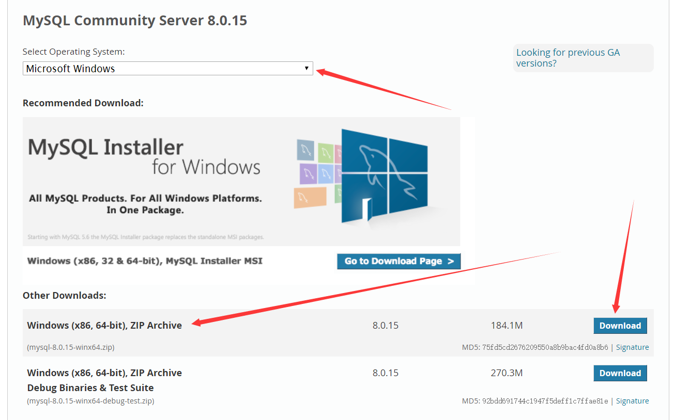
点击“download”按钮跳转到下页
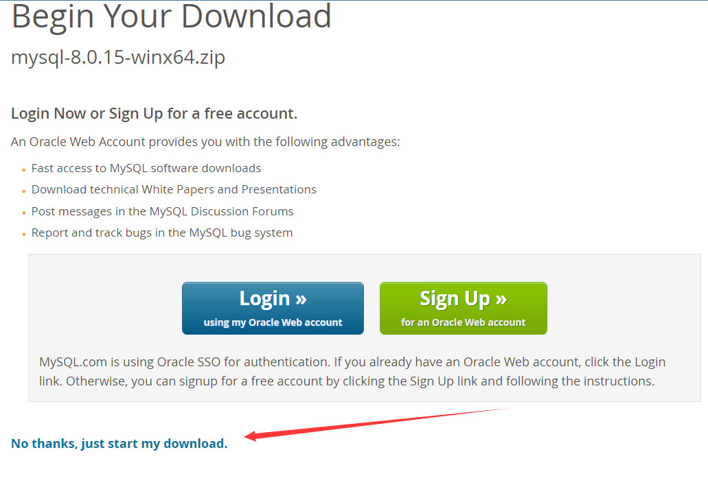
点击“No thanks, just start my download.”开始下载
## 安装
1. 将下载的mysql-8.0.15-winx64移动到一个硬盘中，我的是d盘
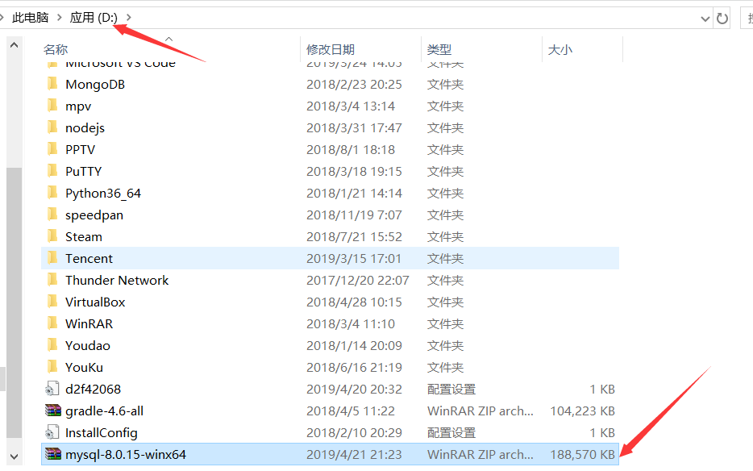
2. 解压mysql-8.0.15-winx64
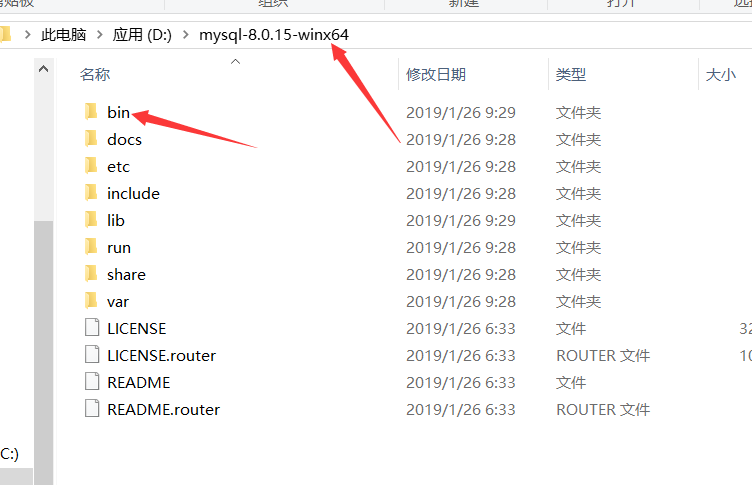
3. 环境变量配置
进入bin文件夹
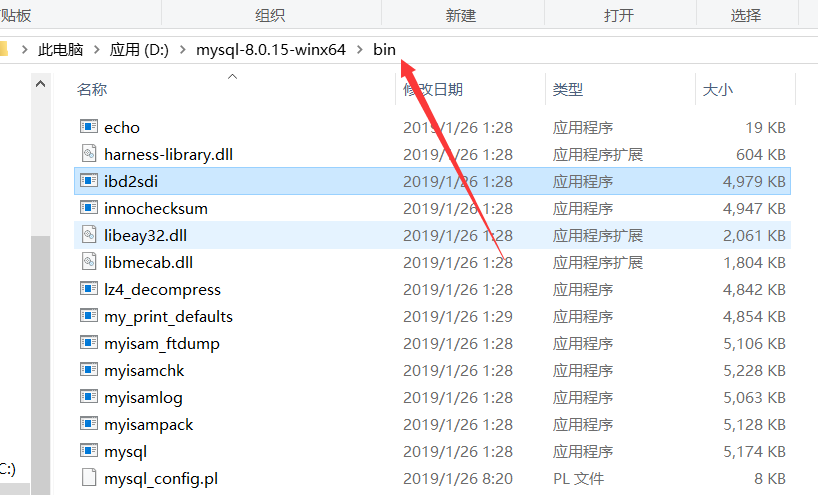
鼠标放到红色箭头处，点下鼠标左键，复制路径
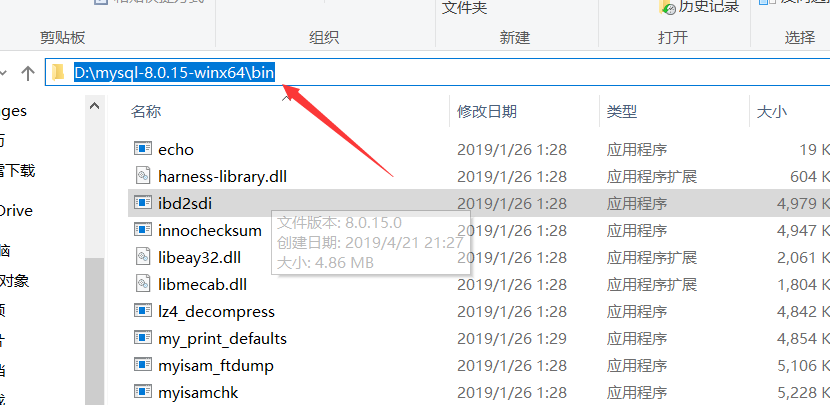
右击“此电脑”选择“属性”  
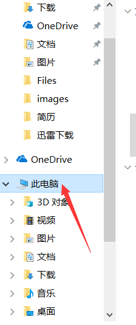  
点击“高级系统设置”  
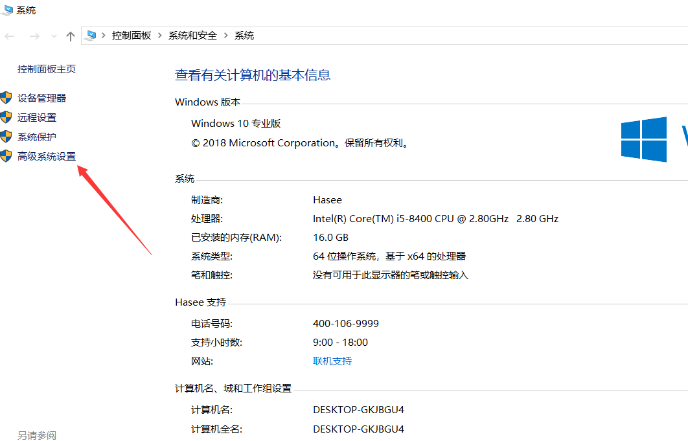  
点击“环境变量”  
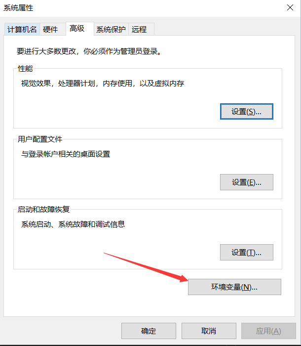  
选择“系统变量”中的”path“，点击“编辑”  
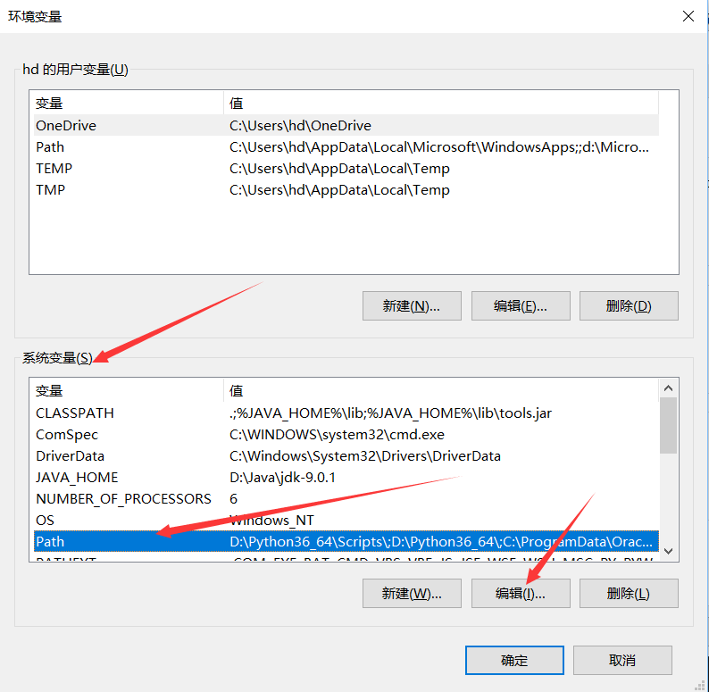  
点击“新建”并再下面的输入框中粘贴刚才复制的bin路径  
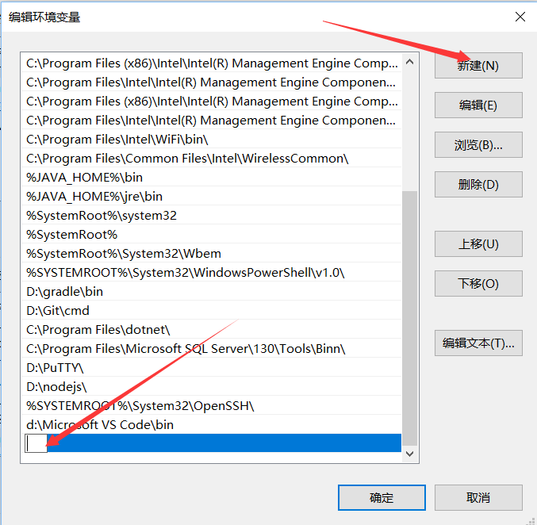  
点击“确定”按钮，其他弹框一次点击“确定”按钮
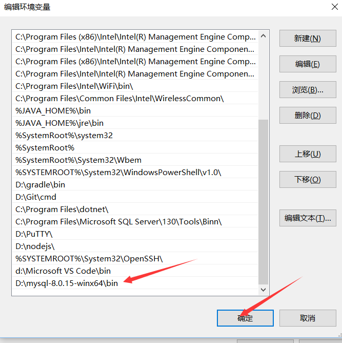  
4. 添加my.ini文件  
在mysql-8.0.15-winx64目录下新建“my.ini”文件  
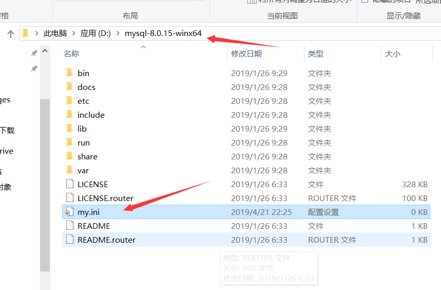  
打开my.ini输入以下文字(basedir和datadir填入自己的mysql解压文件夹）：  
```
[mysqld]
# 设置3306端口
port=3306
# 设置mysql的安装目录
basedir=D:\\mysql-8.0.15-winx64
# 设置mysql数据库的数据的存放目录
datadir=D:\\mysql-8.0.15-winx64\\data
# 允许最大连接数
max_connections=200
# 允许连接失败的次数。这是为了防止有人从该主机试图攻击数据库系统
max_connect_errors=10
# 服务端使用的字符集默认为UTF8
character-set-server=utf8
# 创建新表时将使用的默认存储引擎
default-storage-engine=INNODB
[mysql]
# 设置mysql客户端默认字符集
default-character-set=utf8
[client]
# 设置mysql客户端连接服务端时默认使用的端口
port=3306
default-character-set=utf8
```


5. 执行安装初始化
鼠标右键点击左下角的”窗口“选择 “windows powershell 管理员” 
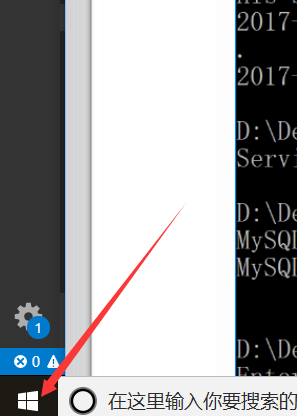  
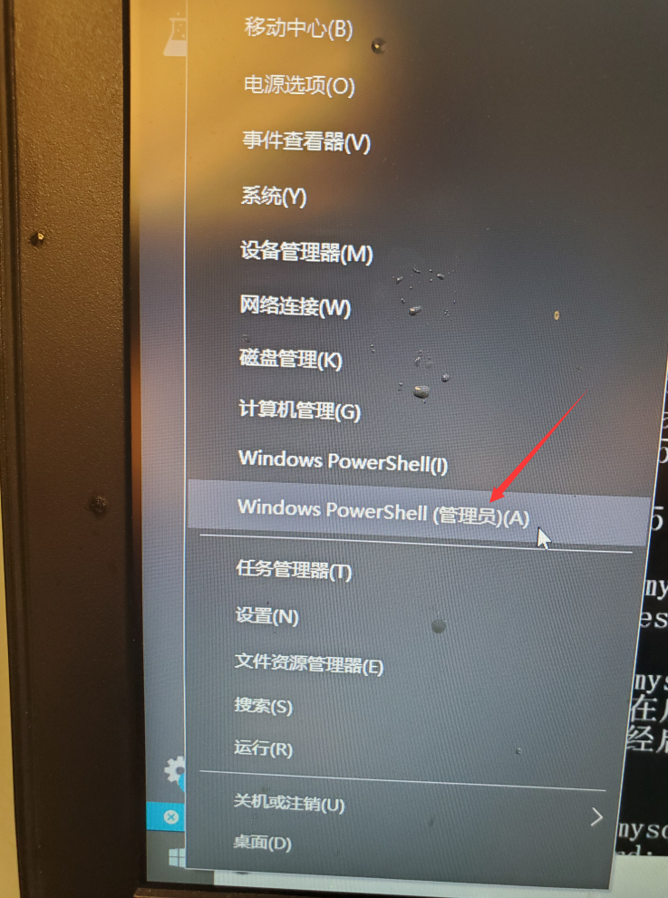  
首先填写刚在mysql解压到的硬盘，例如，我的是d盘，输入"D:"回车  
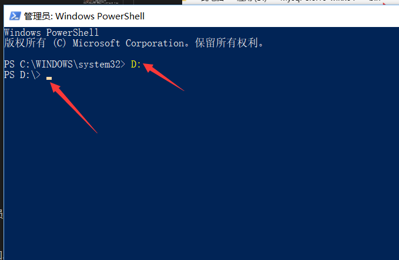  
进入bin文件夹，输入"cd mysql-8.0.15-winx64\bin" 回车  
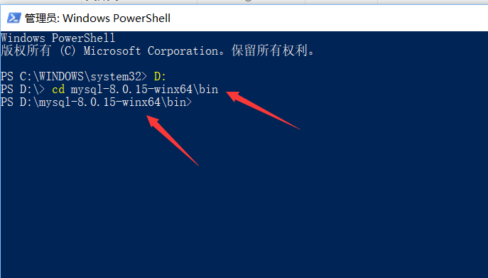  
接着输入"mysqld --initialize --user=mysql --console"回车  
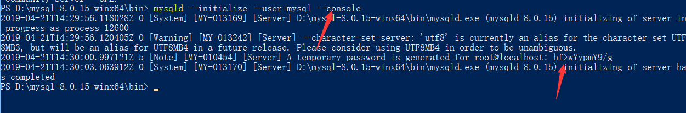 
*记住密码，我的是hf>wYypmY9/g，每个人不一样*  
然后输入"mysqld install"回车    
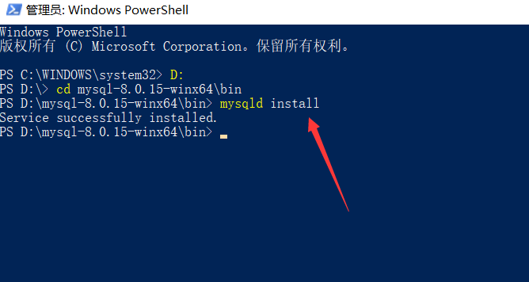 
6. 启动mysql，以后每次打开电脑使用mysql的时候，可以在powershell输入"net start mysql"  
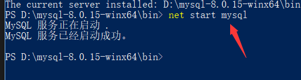
7. 进入数据库，输入"mysql -u root -p"然后输入刚才记住的密码  
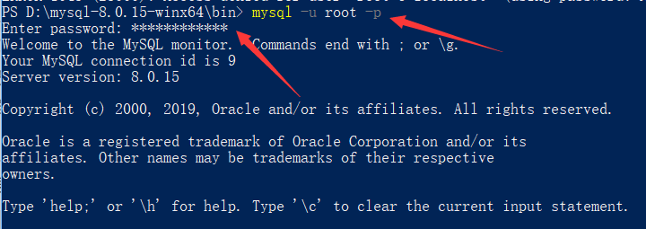
8. 修改密码，刚才的密码太难用，进入数据库后，可以输入以下命令进行修改,以后输入mysql -u root -p后就可以输入自己的密码了
```sql
ALTER USER 'root'@'localhost' IDENTIFIED WITH mysql_native_password BY '12345678';
```  
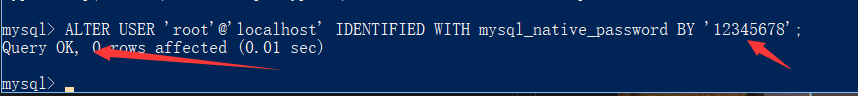  
9. 测试，输入 "shows databases;"  完成安装  
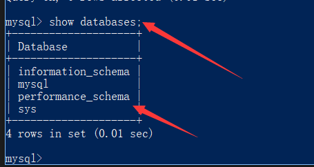
10. 退出mysql，输入"exit;"  
