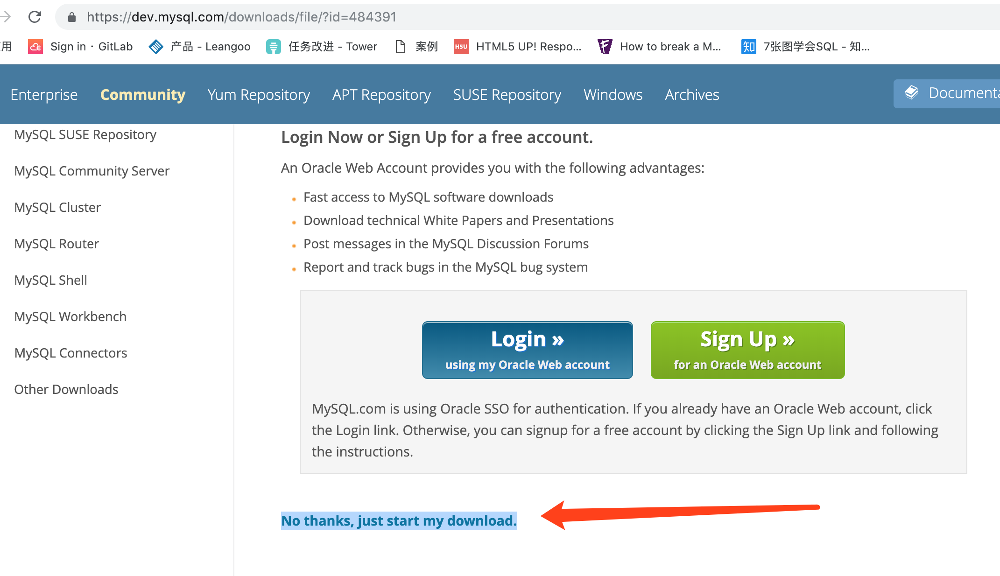
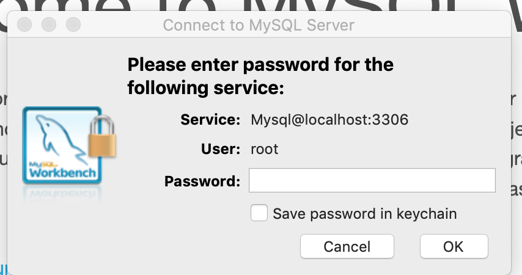

## 创建一个sql文件并导入
使用txt或者vscode创建一个sql文件    

1. 打开vscode，点击"创建文件"  

2. 输入一下命令，包含创建数据库，使用数据库，创建表以及插入数据。  

    ```
    create database test;
    use test;
    create table testtable (
        id int,
        name varchar(10)
    );
    insert into testtable (id,name) values (1,'你好');
    ```

      

3. 保存或另存为一个sql文档  
文件->保存（另存为）-> 保存位置可以在桌面"ddd.sql"  
  
  

4. 输入`mysql -u root -p`加密码登陆  
5. 查看当前数据库列表`show databases;`  

    ```
    mysql> show databases;
    +--------------------+
    | Database           |
    +--------------------+
    | boxshop            |
    | information_schema |
    | mysql              |
    | performance_schema |
    | sys                |
    +--------------------+
    5 rows in set (0.00 sec)
    ```

6. 查看刚才所保存的sql的路径 在扩展坞的终端上右击选择“新建窗口” 
  

    在新建的终端上输入`cd Desktop/`表示进入桌面文件夹，然后输入`ls`显示该文件夹下的文件以及文件夹目录。应该会有刚才保存的'ddd.sql'  
    在终端中输入命令`pwd`,表示显示当前文件夹(本处指桌面)在整个操作系统中的绝对路径，可以看到绝对路径为`/Users/apple/Desktop`,那么刚才sql文件的路径就是`/Users/apple/Desktop/ddd.sql` 

    ```
    192:Desktop apple$ pwd
    /Users/apple/Desktop
    ```
7. 导入sql文件，在mysql中导入的命令是`source xxx.sql`,我们在第一个登陆mysql的终端输入`source /Users/apple/Desktop/ddd.sql`  

    ```
    mysql> source /Users/apple/Desktop/ddd.sql
    Query OK, 1 row affected (0.00 sec)

    Database changed
    Query OK, 0 rows affected (0.00 sec)

    Query OK, 1 row affected (0.00 sec)
    ```  
    *另一种导入sql文件的方法，如果数据库以及存在，可以使用mysql -u用户名 -p密码 数据库名 < 数据库名.sql。`mysql -u root -p密码 test < ddd.sql`*

8. 查看刚才导入的sql  
    * 查看数据库，`show databases;`

        ```
        mysql> show databases;
        +--------------------+
        | Database           |
        +--------------------+
        | boxshop            |
        | information_schema |
        | mysql              |
        | performance_schema |
        | sys                |
        | test               |
        +--------------------+
        6 rows in set (0.00 sec)
       
        ```  

    * 查看表，`use test;show tables;`    

        ```
        mysql> use test;show tables;
        Database changed
        +----------------+
        | Tables_in_test |
        +----------------+
        | testtable      |
        +----------------+
        1 row in set (0.00 sec)
        ```  

    * 查看表的内容， `select * from testtable;`

        ```
        mysql> select * from testtable;
        +------+--------+
        | id   | name   |
        +------+--------+
        |    1 | 你好   |
        +------+--------+
        1 row in set (0.00 sec)
        ```  
    
可以看出我们的数据库建好，数据表建好，而且插入了数据。以后可以写sql文档，然后导入，方便修改

## 导出数据库
1. 我们在test数据库的testtable表中插入一项数据`insert testtable (id,name) values (2,'雷猴啊');`,  

    ```
    mysql> insert testtable (id,name) values (2,'雷猴啊');
    Query OK, 1 row affected (0.00 sec)
    ```  

    然后使用`select * from testtable;`  

    ```
    mysql> select * from testtable;
    +------+-----------+
    | id   | name      |
    +------+-----------+
    |    1 | 你好      |
    |    2 | 雷猴啊    |
    +------+-----------+
    2 rows in set (0.00 sec)
    ```  
    表示我们插入数据成功了。
2. 导出数据库  
    导出的语法为`mysqldump -u root -p [-d] 数据库名 [表名] > 生成文件名;`  
    如果加上`-d`参数表示只导出表结构。  

    再次打开一个新的终端。依旧`cd Desktop/`，进入桌面，表示我们会把sql文件导出到这个文件夹    

    ```
    192:~ apple$ cd Desktop/
    192:Desktop apple$ 
    ```  
    
    在新终端中输入`mysqldump -u root -p test > mytest.sql;`然后输入密码  

    ```
    192:Desktop apple$ mysqldump -u root -p test > mytest.sql;
    Enter password: 
    192:Desktop apple$ 
    ```

    然后我们就可以用vscode或其他编辑器打开刚才保存的mytest.sql文件了。方便以后导入，但可以看到文件里面没有创建数据库`create database xxx;`以及使用`use xxx;`的语句，将该语句导入其他数据库的时候需要建立数据库并`use xxx;`  

3. 导出数据表，只在数据库名后面加上表名即可，例如`mysqldump -u root -p test testtable > mytesttable.sql;`  

4. 导出查询的数据。
    当查询出结果后我们需要将结果数据导出，语法结构为`select 语句 into outfile '保存路径+文件名';`   
    我们在终端输入：`select * from testtable where id=1 into outfile '/tmp/select.sql';`   
    或者导出excel表格：`select * from testtable where id=1 into outfile '/tmp/select.xls';`  

    如果结果出现`ERROR 1290 (HY000): The MySQL server is running with the --secure-file-priv option so it cannot execute this statement`,说明mysql限制一些导入导出查询数据(secure_file_priv参数用于限制LOAD DATA, SELECT …OUTFILE, LOAD_FILE()传到哪个指定目录)  

    * 首先，新建一个终端，输入`sudo vim /usr/local/etc/my.cnf`,输入密码，在英文输入法下，点击键盘`i`，下面会出现INSERT字样，然后输入：  

        ```
        [mysqld]
        secure-file-priv = ""
        ```    

        然后点击键盘的冒号`:`,界面下面会显示冒号，然后输入字母`wq`.
    * 然后点击"设置"->mysql(小鲸鱼(海豚))-configuration,在configuration file填入`/usr/local/etc/my.cnf`,并打上勾,点击最下面的`Apply`按钮  

          

    * 在该界面下点击instances，可以看到左边是绿色的点，点击"stop mysql server",变成红色点，再次点击"start mysql server"编程绿色，中间可能输入电脑密码  
          
          

    * 再次登陆mysql，输入选择数据库，输入刚才的导出语句,显示`Query OK, 1 row affected (0.00 sec)`表示成功。  
    * 打开保存的文件，由于macos一些权限问题，我们只能保存在/tmp文件夹下(可以通过一些设置改变)，打开finder(访达 :mouse: )->屏幕左上角的"前往"->"前往文件夹",输入框中填入`/tmp`,注意前面的斜杠，点击"前往"，就看到了输出的文件。  
        

5. 导入查询的数据，需要提前建好表。语法为：`load data local infile '保存路径+文件名' into table 表名 character set utf8;`   
6. 如果在一个sql文件中编写完select语句并想将结果输入到一个文件，那么可以在文件中加入into outfile，再source该文件.

## 可视化工具 
可视化工具主流的是自带的 MySQL Workbench(免费，mac版偶尔会卡，需要重启)和navicat(收费)，我们主要用workbench
### mac版
* [下载地址](https://dev.mysql.com/downloads/workbench/)  
* 选择mac os，点击download ，第二个页面选择 
      
    

* 安装 按照图示直接拖到applications  
* 启动 点击启动台，找到"mysql workbench"（海豚图标），如果显示一下图片，点击“打开”  

       

    点击`local instance 3306`  

      

    输入mysql的密码点击ok

      

* 简单使用 点击左上角的"schemas"(在mysql中schema表示多个table的集合，可以等于database)  

      

    在中间上面的query区输入语句，点击上面的闪电执行  

    

